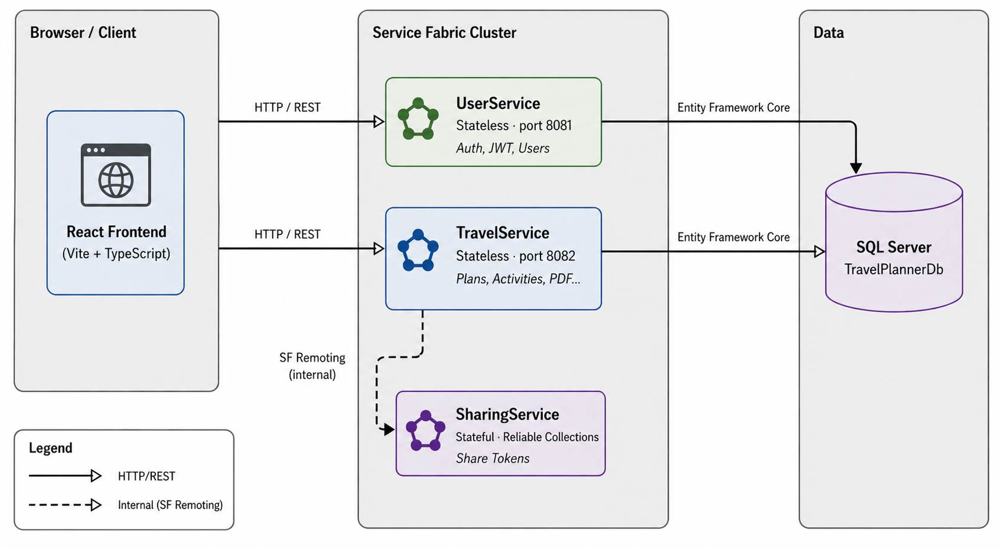
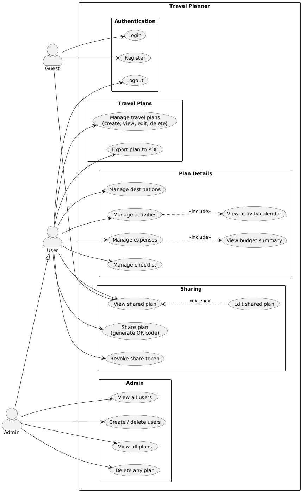

# Travel Planner

A full-stack web application for planning and organizing trips - from initial idea to a detailed daily schedule. Built as a university project for the course **"Web Programming in Infrastructure Systems"** at the Faculty of Technical Sciences, Novi Sad.


---

## 📋 Table of Contents

- [Features](#-features)
- [System Architecture](#-system-architecture)
- [Prerequisites](#-prerequisites)
- [Setup & Running](#-setup--running)
  - [1. Local Service Fabric Cluster](#1-local-service-fabric-cluster)
  - [2. Database Configuration](#2-database-configuration)
  - [3. Start the Backend](#3-start-the-backend)
  - [4. Start the Frontend](#4-start-the-frontend)
- [Environment Variables](#-environment-variables)
- [Default Credentials](#-default-credentials)
- [Project Structure Notes](#-project-structure-notes)
- [Documentation](#-documentation)

---

## ✨ Features

| Area | What you can do |
|---|---|
| **Travel Plans** | Create, view, edit, and delete plans with name, description, dates, budget, and notes |
| **Destinations** | Add multiple destinations per plan with arrival/departure dates |
| **Activities** | Plan daily activities with time, location, cost, and status - view them in a calendar |
| **Expenses & Budget** | Track expenses by category, see budget usage with a live breakdown |
| **Checklist** | Build a packing list, mark items as done, use quick-add suggestions |
| **Sharing** | Generate a QR code share link - VIEW or EDIT access level |
| **PDF Export** | Download a formatted PDF of the full plan |
| **Admin Panel** | Manage all users and plans across the system |

---

## 🏗 System Architecture

The backend is implemented on **Microsoft Service Fabric** with three microservices, each with a distinct responsibility:

| Service | Type | Port | Responsibility |
|---|---|---|---|
| **UserService** | Stateless | 8081 | Registration, login, JWT issuance, user management |
| **TravelService** | Stateless | 8082 | Plans, destinations, activities, expenses, checklist, PDF, sharing endpoints |
| **SharingService** | Stateful | internal | Share token storage via Reliable Collections |

TravelService communicates with SharingService over **Service Fabric Remoting** - an internal cluster call that never leaves the SF environment. Both UserService and TravelService persist data to a shared **SQL Server** database via **Entity Framework Core**.



---

## 📋 Prerequisites

Make sure all of the following are installed before running the project:

- **Visual Studio 2022** (v17.x or later) - run **as Administrator**
- **.NET 8 SDK**
- **Service Fabric SDK and Runtime** - includes the Local Cluster Manager
- **SQL Server** (Express or Developer edition)
- **Node.js 18+** with npm

---

## 🚀 Setup & Running

### 1. Local Service Fabric Cluster

After installing the Service Fabric SDK, the **Service Fabric Local Cluster Manager** appears in your system tray.

1. Right-click the system tray icon → **Start Local Cluster**
2. Choose **1 Node** (sufficient for local development)
3. Wait until the icon turns green - the cluster is ready
4. You can verify the cluster is running at [http://localhost:19080](http://localhost:19080) (Service Fabric Explorer)

### 2. Database Configuration

Open `Server/UserService/appsettings.json` and `Server/TravelService/appsettings.json`. Set the connection string to point to your local SQL Server instance:

```json
"ConnectionStrings": {
  "DefaultConnection": "Server=localhost;Database=TravelPlannerDb;Trusted_Connection=True;TrustServerCertificate=True;"
}
```

> Both services share the same database (`TravelPlannerDb`). Migrations run automatically on startup - the database and all tables are created on the first run. If you use SQL Server authentication instead of Windows auth, update the connection string accordingly.

### 3. Start the Backend

1. Open the solution (`TravelPlanner.sln`) in **Visual Studio 2022**
2. Right-click the solution → **Set Startup Projects** → select the **Service Fabric Application project** as the single startup project
3. Press **F5** - Visual Studio deploys and starts all three services to the local cluster

> ⚠️ Visual Studio must be running **as Administrator** for Service Fabric deployment to work.

You can confirm all services are running in Service Fabric Explorer at [http://localhost:19080](http://localhost:19080).

### 4. Start the Frontend

Open a terminal in the `client/` directory:

```bash
npm install
npm run dev
```

The app will be available at **http://localhost:5173**.

---

## 🔧 Environment Variables

The frontend reads all backend URLs from a `.env` file in the `client/` directory. Create `client/.env` with the following content:

```env
VITE_USER_SERVICE_URL=http://localhost:8081
VITE_TRAVEL_SERVICE_URL=http://localhost:8082
VITE_FRONTEND_URL=http://localhost:5173
```

> A `.env.example` file is included in the repository as a template. Do not commit `.env` to version control.

---

## 🔑 Default Credentials

A default admin account is seeded automatically on first startup:

| Field | Value |
|---|---|
| Email | `admin@travelplanner.com` |
| Password | `Admin123!` |
| Role | Admin |

---

## 📁 Project Structure Notes

```
TravelPlanner/
├── Server/
│   ├── TravelPlanner.sln          # Visual Studio solution
│   ├── TravelPlannerApp/          # Service Fabric application project
│   ├── UserService/               # Stateless SF service - auth & users
│   ├── TravelService/             # Stateless SF service - core features
│   ├── SharingService/            # Stateful SF service - share tokens
│   └── TravelPlanner.Shared/      # Shared DTOs and interfaces
└── client/                        # React + TypeScript frontend
    ├── src/
    │   ├── api/                   # Axios instances (user.api.ts, travel.api.ts)
    │   ├── context/               # AuthContext
    │   ├── components/            # Shared UI primitives and layout
    │   └── features/              # Feature folders (auth, travel-plan, activity, ...)
    ├── .env                       # Environment variables (not committed)
    └── .env.example               # Template for environment variables
```

Each feature in `client/src/features/` follows the same structure:

```
features/<feature>/
├── api/          # API functions - all HTTP calls live here
├── types/        # TypeScript interfaces
├── components/   # UI components for this feature
└── pages/        # Page-level components and section containers
```

---

## 📄 Documentation

<details>
<summary><strong>Use Case Diagram</strong></summary>
<br>



**Actors**

| Actor | Description |
|---|---|
| **Guest** | Unauthenticated visitor - can register, log in, and view a shared plan via token |
| **User** | Authenticated account holder - full access to their own plans and all plan features |
| **Admin** | Extends User - additionally manages all users and all plans system-wide |

**Key relationships**

- `Manage activities` **includes** `View activity calendar` - the calendar is always part of the activities section
- `Manage expenses` **includes** `View budget summary` - the budget card is always rendered with expenses
- `Edit shared plan` **extends** `View shared plan` - editing is an optional enhancement of viewing, available only to EDIT token holders

</details>
